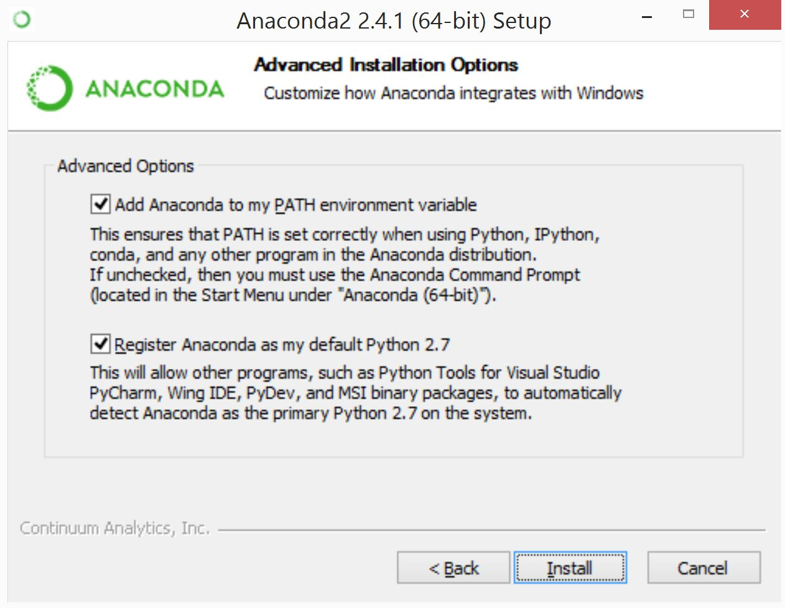

# Installing Anaconda 

Follow along with the instructions below for your particular operating 
system. If you're working off a unix distribution that is not Mac OS X, 
you should be able to just work off the Mac OS X instructions, but change
which installation of Anaconda you're downloading (i.e. the Ubuntu install 
if you're running Ubuntu, or the Linux install if you're running a different
installation of Linux).

## Windows Users 

1.) Download [Anaconda][Anaconda], making sure to select the Windows 
version, and the version using **Python 2.7**. **Make sure that you 
have the `Add Anaconda to my PATH environment variable` checked when going 
through installation...**



## Mac OS X Users

1.) Open up your terminal application, and navigate to your root directory. 
You can find the terminal application in `Finder`, and you can navigate to 
your root directory by typing `cd` into the terminal and pressing enter. 

2.) Enter the following command to download Anaconda: 

```bash 
curl -O https://3230d63b5fc54e62148e-c95ac804525aac4b6dba79b00b39d1d3.ssl.cf1.rackcdn.com/Anaconda2-2.4.1-MacOSX-x86_64.sh 
```

3.) Enter the following command to install Anaconda: 
    
```bash 
bash Anaconda2-2.4.1-MacOSX-x86_64.sh
```

4.) Enter the following command to update all of the packages within Anaconda: 

```bash 
conda update --all 
```

If prompted, enter `yes` when prompted. If you aren't prompted, then 
all your packages are up to date and you are good to go!


[Anaconda]:http://docs.continuum.io/anaconda/install#windows-install
