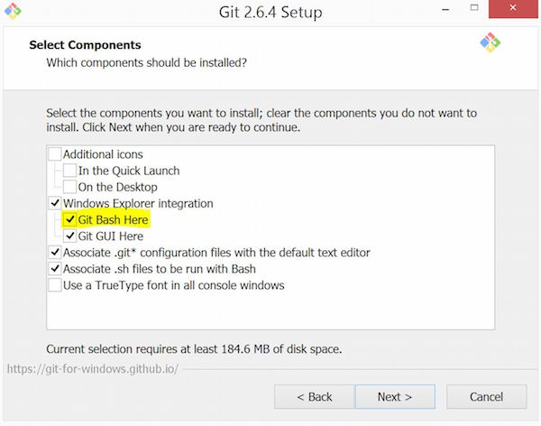
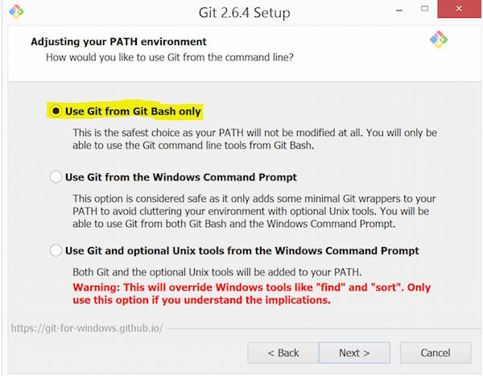

# Installing Git 

## Windows Users

1.) You will to install Git Bash. This will become the terminal
through which you run commands, interact with your programs, etc. It also 
has the benefit of handling git installation on your Windows machine. Download
it here: 

[www.git-scm.com/download/vim](https://www.git-scm.com/download/vim)

Follow through the installation instructions. You should be able to just
click next through all of the instructions, **but** along the way make
sure that on the following two screens you make sure the following 
are checked: 

* `Git Bash Here` in the `Select Components` screen. 



* `Use Git from Git Bash only` in the `Adjusting your PATH environment` 
  screen. 



2.) Navigate to the folder where Git Bash was installed, and open git-bash
by clicking on the `git-bash.exe` executable. Once it opens, I would suggest
either creating a shorcut to it on your Desktop or pinning it to your 
taskbar. 

3.) Now that we have Git Bash installed and a Git Bash terminal open (this 
will be a Unix terminal), we can make sure that we installed Anaconda 
correctly earlier. Run the following command in the Git Bash terminal: 

```bash
conda update --all
```

If you get the error `conda command not found`, or something like it, 
then Anaconda was not installed correctly. If you don't, then 
continue on...

If prompted, enter `yes` when prompted. If you aren't prompted, and
there was no error, then all your packages are up to date and you are 
good to go!

## Mac Users

1.) Open the terminal, and enter the following command: 

```bash
xcode-select --install
```

Follow the prompts to install it (if you get an error telling you that it 
is already installed, skip to step 2). What this will do is take care of 
installing `git` for you, and making sure it is in the right place on your 
computer. 

2.) In the terminal, type `git` and press `Enter`. You should see something 
along these lines if it has installed correctly: 

```bash 
usage: git [--version] [--help] [-C <path>] [-c name=value]
           [--exec-path[=<path>]] [--html-path] [--man-path] [--info-path]
           [-p | --paginate | --no-pager] [--no-replace-objects] [--bare]
           [--git-dir=<path>] [--work-tree=<path>] [--namespace=<name>]
           <command> [<args>]
....
....
....
```
